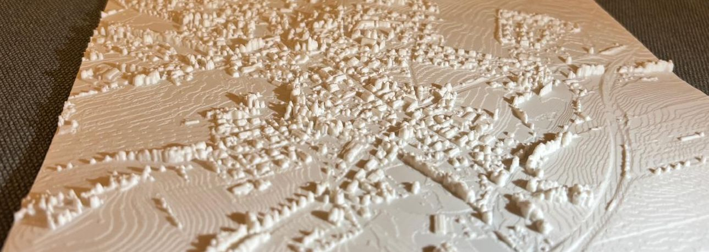
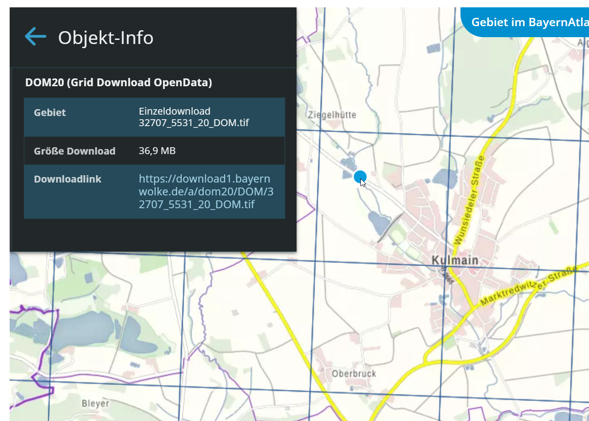
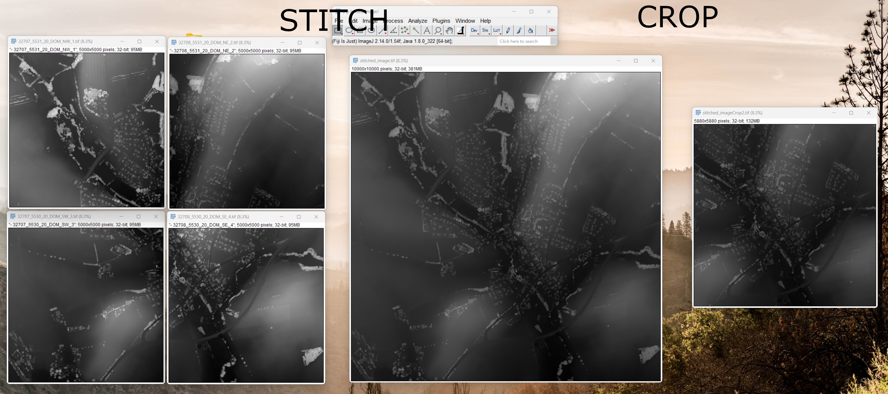
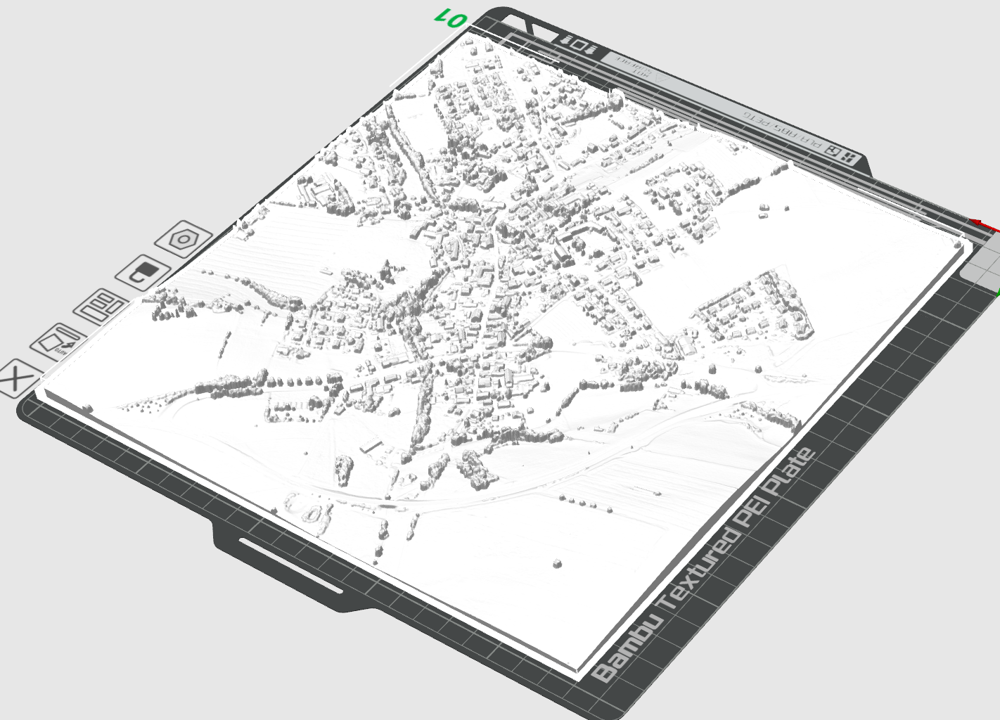

# Bayern GeoTIF to 3D printable model

This workflow is designed to create 3D printable models from GeoTIF Files provided by the Bayernatlas (https://atlas.bayern.de/), which is bavaria, a region of Germany.
It might work with other data as well but no promises made.

**Disclaimer**: I have no connection to the BayernAtlas project and thank it for providing this data.

## Requirements

### Software

- Python
- FIJI ImageJ [optional but recommended]
- Blender [optional]

### Python Packages

- numpy
- numpy-stl
- PIL
- tqdm

## Workflow

1. Download the Data from https://geodaten.bayern.de/opengeodata/index.html. Chose "*Digitales Oberflächenmodell 20cm*".
There you can download 16 bit float tif images. Each pixel value (z-Value) represents a height of the geo surface in meters. The surface includes mountains, buildings and vegetation. The raster has a resolution of 20cm, i.e. neighboring pixels are 20cm apart.

2. *Optional*: Open and inspect the tif files in FIJI (Drag and Drop, confirm with enter). Ensure that you have downloaded tifs that make up a rectangle
3. Stitch the downloaded tifs so that you have only one. Use the `Stichter.py` to stitch the tifs. It will automatically detect matching edges. 
Customize the script by adapting the parameters at the bottom:
- input and output filepaths 
4. *Optional*: Crop the tif using FIJI so you only print your region of interest. Use 
`Image -> Crop`. Other preprocessings may also be done in this step (e.g. rotations).

5. Convert the tif to an stl using the `Converter.py`. 
Customize the script by adapting the parameters at the bottom:
- Input- and output-filepaths 
- X-Y subsampling
- Scale
6. Inspect the generated STL in Blender or other suited applications.
7. Import the STL in your Slicer. Bambu Studio has a simplify command that reduces the model size which worked nicely for me. Use a high quality profile to print.

## Tweaks

- The model might be quite large and blender or your slicer might not be able to handle it. You can try:
    - Use the subsampling in the conversion step.
    - Divide the model in smaller pieces
    - Use the Remesh Modifier of blender (Did not work for me, always crashed)
- In case you want to tile multiple prints, note that they will not align properly in height. This is because the z-Height is reduced before creating the model to save filament. If you do not want to solve this physically, you can adapt the `Converter.py`. Adapt the line `height_data -= zMin` and instead of subtracting the minimum z-Value, subtract a constant value for all models. To find the value that wastes the least filament you could convert all models and observe the output logs. It should show the z-Range of the model, e.g. 
`Scaled Image size (1470, 1470), z: 468.5786437988281-518.4197387695312` 
Take the minimum of all models.
- The STL model might be mirrored: Use the subsampling parameter of the conversion-step with negative sign. 
- The images from BayernAtlas are slightly rotated (see screenshot above). You may compensate this in FIJI if you need north facing perfectly up.
- I flavored this guide very bavaria specific but you might learn something from this example which might help you apply the method to non-bavarian use-cases. You may find *Geoportale* for other german areas e.g. here https://www.geo.fu-berlin.de/bibliotheken/Kartensammlung/Geoportale-der-Landesaemter.html